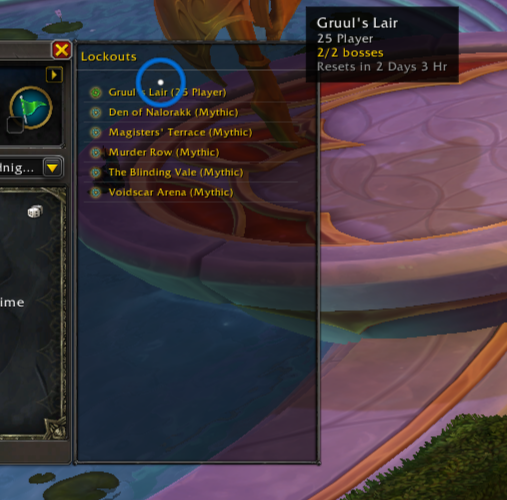

# EZLockout

A lightweight World of Warcraft addon that displays your active raid and dungeon lockouts in a sidebar attached to the Dungeon & Raids (PVE) window.

## Features

- Shows all active instance lockouts with boss progress and time remaining
- Sidebar attaches to the right side of the Dungeon & Raids window
- Collapsible via a toggle button — state persists across sessions
- Raids sorted above dungeons, alphabetically within each group

## Installation

Copy the `EZLockout` folder into your `Interface/AddOns` directory.

## Usage

Open the Dungeon & Raids window (default: `I` key). The lockout sidebar appears automatically. Click the arrow button at the top-right of the window to collapse or expand it.
